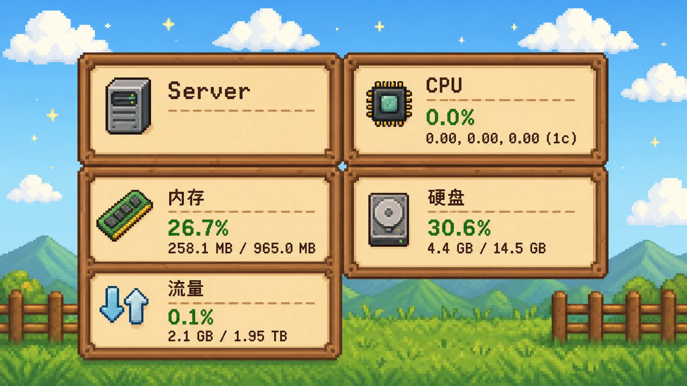

<h3 align="center">Komari Stardew</h3>
<p align="center">
星露谷物语像素风主题 · 基于 Vue 3 + Vite + reka-ui + Tailwind CSS v4 构建
</p>



## 使用

1. 从 [Release 页面](https://github.com/nekomini88/komari-theme-Stardew/releases) 下载 `komari-theme-Komari-Stardew-v*.zip`
2. 登录 Komari Monitor 后，点击 `设置` → `主题管理`
3. `上传主题` 选择 zip 文件
4. 刷新页面，在主题设置中选择 `Komari Stardew`

## 环境要求

- Node.js: `^20.19.0` 或 `>=22.12.0`
- Bun: `>=1.2.0`

## 开发

```bash
bun install
bun run dev
```

## 构建

```bash
bun run build
```

产物：
- `dist/` — 构建后的静态站点
- `release/komari-theme-Komari-Stardew-v<version>-<hash>.zip` — 可直接上传到 Komari 的主题包

## 打包

单独打包 zip：

```bash
bun run package
```

## 技术栈

| 类别 | 技术 |
| --- | --- |
| 框架 | Vue 3 |
| 构建工具 | Vite 7 |
| UI 组件 | reka-ui（shadcn-vue 风格组件） |
| 样式方案 | Tailwind CSS v4 + tw-animate-css |
| 状态管理 | Pinia 3 |
| 路由 | Vue Router 5 |
| 提示系统 | vue-sonner（Toaster） |
| 图标 | @iconify/vue |
| 图表 | vue-echarts |
| 3D 地球 | cobe |

## License

[MIT](./LICENSE)
