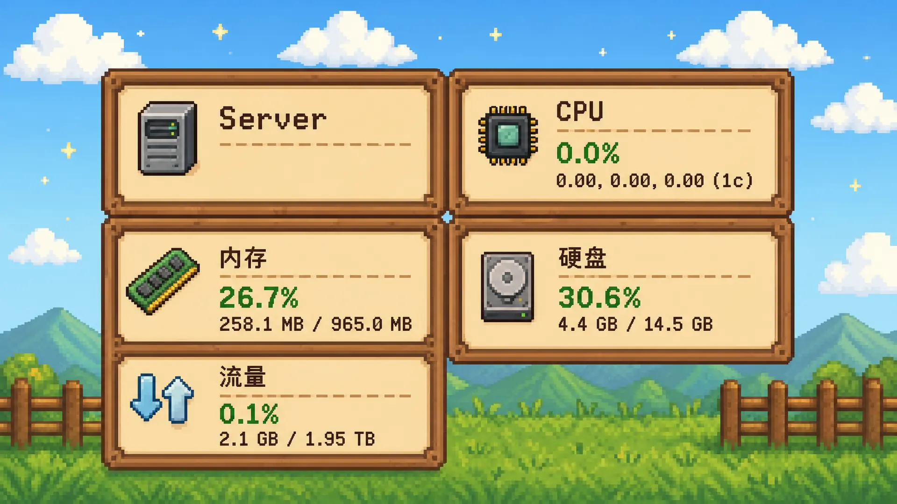

<h3 align="center">Komari Stardew</h3>
<p align="center">
星露谷物语像素风主题 · 基于 Vue 3 + Vite + reka-ui + Tailwind CSS v4 构建
</p>



## 使用

1. 从 [Release 页面](https://github.com/nekomini88/komari-theme-Stardew/releases) 下载 `komari-theme-stardew-build-*.zip`（或仓库内 `release/` 下的 `komari-theme-Komari-Stardew-v*.zip`）
2. 登录 Komari Monitor 后，点击 `设置` → `主题管理`
3. `上传主题` 选择 zip 文件
4. 刷新页面，在主题设置中选择 `Komari Stardew`

## 素材与视觉规范

- **像素素材**：AI 生成的像素风 PNG 图片素材位于 `public/images/`（构建后输出到 `dist/images/`，含 banner / logo / 背景贴图等）
- **像素字体**：`@fontsource/press-start-2p`（标题像素字）+ `@fontsource/vt323`（正文）
- **装饰 sprite**：`src/assets/sprites/*.svg`（鸟 / 兔子 / 蝴蝶 / 萤火虫 / 花等动态元素）
- **视觉规范**：`references/stardew-visual-style.md` 定义设计令牌（色板 / 圆角 / 像素字体 / 背景契约），通过 `data-theme="stardew"` 激活
- **测试**：`tests/` 含 Vitest 单元测试（`bun run test`）

## 环境要求

- Node.js: `^20.19.0` 或 `>=22.12.0`
- Bun: `>=1.2.0`

## 开发

```bash
bun install
bun run dev
```

## 构建

```bash
bun run build
```

`build` = 类型检查 + vite 构建 + 自动打包主题 zip（`scripts/package-theme.ts`）。产物：

- `dist/` — 构建后的静态站点
- `release/komari-theme-Komari-Stardew-v<version>-<hash>.zip` — 可直接上传到 Komari 的主题包

单独打包 zip（不重新构建）：

```bash
bun run package
```

## 发布

```bash
bun run publish    # 同步提升 package.json 与 komari-theme.json 版本号并 git add
```

推送后 GitHub Actions（`release-on-version-bump.yml`）自动构建 `komari-theme-stardew-build*.zip` 并创建 GitHub Release。

## 目录结构

```
komari-theme-Stardew/
├── src/                    # 主题源码（Vue 组件 / 样式 / sprites）
├── public/images/          # AI 像素 PNG 素材（banner / logo / 背景）
├── scripts/
│   ├── package-theme.ts    # 打包主题 zip
│   └── publish.ts          # 版本号提升
├── references/             # stardew-visual-style.md 视觉规范
├── release/                # 打包产物（zip，gitignored 视情况）
├── komari-theme.json       # 主题清单
├── spec.yaml / tests/      # 规范与测试
└── package.json
```

## 技术栈

| 类别     | 技术                             |
| -------- | -------------------------------- |
| 框架     | Vue 3                            |
| 构建工具 | Vite 7                           |
| UI 组件  | reka-ui（shadcn-vue 风格组件）   |
| 样式方案 | Tailwind CSS v4 + tw-animate-css |
| 状态管理 | Pinia 3                          |
| 路由     | Vue Router 5                     |
| 提示系统 | vue-sonner（Toaster）            |
| 图标     | @iconify/vue                     |
| 图表     | vue-echarts                      |
| 3D 地球  | cobe                             |
| 像素字体 | Press Start 2P / VT323           |

## License

[MIT](./LICENSE)
